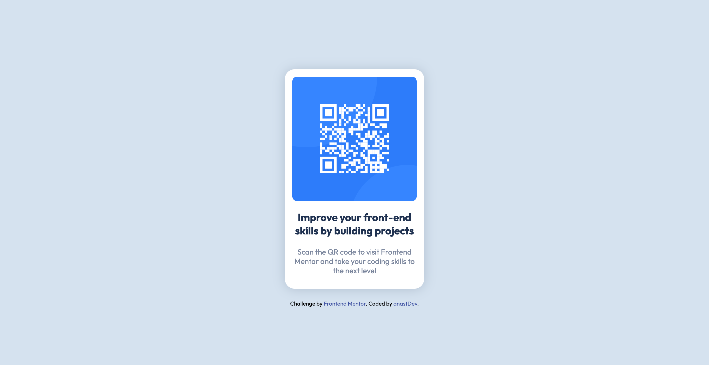

# Frontend Mentor - QR code component solution

## Table of contents

- [Overview](#overview)
  - [Screenshot](#screenshot)
  - [Links](#links)
- [My process](#my-process)
  - [Built with](#built-with)
  - [What I learned](#what-i-learned)
  - [Continued development](#continued-development)
  - [Useful resources](#useful-resources)
- [Author](#author)
- [Acknowledgments](#acknowledgments)

## Overview

### Screenshot



### Links

-  [Solution URL](https://github.com/anastDev/qr-code-component_FrontendMentor.git)
- [Live Site URL]()

## My process

### Built with

- Semantic HTML5 markup
- CSS custom properties

### What I learned

This project provided me with an invaluable opportunity to deepen my understanding of layout design and responsiveness in web development.

**Getting Started**

At the beggining, I contemplated using Bootstrap to build the card component, but I wanted something more personalized. This led me to design a custom layout for the card, allowing for greater creativity and control over the final appearance.

**Structuring the Card**

One of the key challenges was organizing the card's elements—the image and the text—within a flexible layout. After some research and experimentation, I decided to utilize the display property, specifically:

```
display: flex;
flex-wrap: wrap;. 
```
This approach allowed me to create a responsive layout that adapts to different screen sizes while maintaining the design's integrity.

**Styling the Card**

Styling the card was a process of trial and error. My goal was to match the provided design as closely as possible. Through various iterations, I refined the styles, adjusting the margins, padding, and other properties until I achieved a look that closely resembled the intended design.

**Centering the Card**

Positioning the card in the center of the page posed another challenge. Initially, I considered using the position property, but it didn't yield the desired result. Instead, I returned to the display property, applying it to the entire body:

```
.body {
  display: flex;
  justify-content: center;
  align-items: center;
  flex-direction: column;
}
```
This method successfully centered the card both vertically and horizontally, ensuring a balanced layout.

**Making the Design Responsive**

To ensure the card was responsive across various devices, I utilized Media Queries. I began by focusing on small screens, then progressively adjusted the layout for larger screens:

```
@media (max-width: 320px) {
  .card {
    width: 78%;
    height: auto;
    position: relative;
  }
  .card-title {
    font-size: 1.3rem;
  }

  .card-text {
    font-size: 0.9rem;
  }

  .footer{
    position: relative;
    left: 5%;
  }
}
```
```
@media (max-width: 1440px) {
  .card {
    width: 17%;
    height: auto;
  }

  .card-title {
    font-size: 1.3rem;
  }

  .card-text {
    font-size: 0.9rem;
  }
}
```
Throughout this process, I made various adjustments to the sizes and layout to ensure that each element fit perfectly and looked good on any screen size.

In conclusion, this project was a great learning experience that allowed me to explore different aspects of web design, from layout creation to responsive design. By overcoming each challenge, I gained a deeper understanding of how to craft a flexible, visually appealing, and user-friendly interface.

### Continued development

**Future Focus Areas**

As I continue to grow in my web development journey, there are several key areas I want to focus on and refine:

1. Mastering Bootstrap

- I recognize the potential of Bootstrap in accelerating development and maintaining consistency across larger projects. Becoming more familiar with this framework will allow me to efficiently tackle complex layouts and streamline the development process in future projects.

2. Deepening Understanding of Display and Position

- The display and position properties are fundamental to effective page layout. I plan to explore these properties in greater depth, as mastering them will enhance my ability to create flexible and precise layouts.

3. Enhancing Responsiveness with Media Queries

- Creating responsive designs is crucial in today’s multi-device world. I want to become more comfortable and proficient with Media Queries to ensure that my designs are not only visually appealing but also functional across a wide range of screen sizes.
By focusing on these areas, I aim to refine my skills and continue building a solid foundation in web development.


### Useful resources

- [Master Media Queries And Responsive CSS Web Design Like a Chameleon! - Slaying the Dragon](https://www.youtube.com/watch?v=K24lUqcT0Ms&t=501s) - This YouTube video was incredibly helpful throughout the project, especially in understanding how to build responsive code. I highly recommend it to anyone who is still learning this concept. In general this channel helped me understand CSS more with fun and creative videos and examples.
- [Learn CSS display property in 4 minutes! ](https://www.youtube.com/watch?v=9T8uxp5hQ60&list=PLZPZq0r_RZOOxqHgOzPyCzIl4AJjXbCYt&index=22) - This is an amazing video which helped me finally understand the display property. I'd recommend this channel to anyone still learning CSS.

## Author

- Frontend Mentor - [@anastDev](https://www.frontendmentor.io/profile/anastDev)


## Acknowledgments

I want to give a hat tip to these two YouTubers, *Slaying the Dragon* and *Bro Code*, who helped me understand basic concepts of HTML & CSS.

